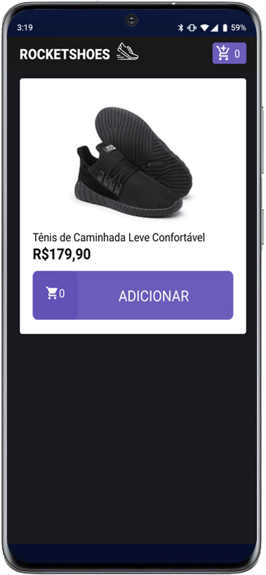

<p align="center" >



</p>

<h1 align="center">Ecommerce mobile version</h1>
<p align="center">
this application is a mobile shoe shop simple, using redux and sagas applying concepts state share</p>


<p align="center">
  
  

  
  
 <a href="https://github.com/abauruel/EcommerceMobile/commits/master">
    
  </a>
 
</p>


##

## Getting Started

### Prerequisites
* [NodeJs](https://nodejs.org/en/)
* [yarn](https://yarnpkg.com/) or **npm** Included in nodejs instalation - package manager
* [json-server](https://www.npmjs.com/package/json-server) - Simulate backend application


### Installing
```
git clone https://github.com/abauruel/EcommerceMobile
```
Can install using your prefencial package manager
``` 
yarn or  npm install
```

### Run

to start server
```
json-server server.json -p 3333
```
run app
```
npx react-native run-android or yarn react-native run-android
```


## Built With
* [axios]()
* [react-native-gesture-handle]()
* [react-native-reanimated]()
* [react-native-vector-icons]()
* [react-native-screens]()
* [react-navigation]()
* [react-redux]()
* [redux-saga]()
* [styled-components]()
* [json-server]()


## Authors

* **Alex Claude** 

See also the list of [contributors](https://github.com/abauruel/EcommerceMobile/graphs/contributors) who participated in this project.

<div>WalleFM Icon made by <a href="https://www.flaticon.com/authors/freepik" title="Freepik">Freepik</a> from <a href="https://www.flaticon.com/" title="Flaticon">www.flaticon.com</a></div>

## License

This project is licensed under the MIT License - see the [LICENSE.md](LICENSE.md) file for details
